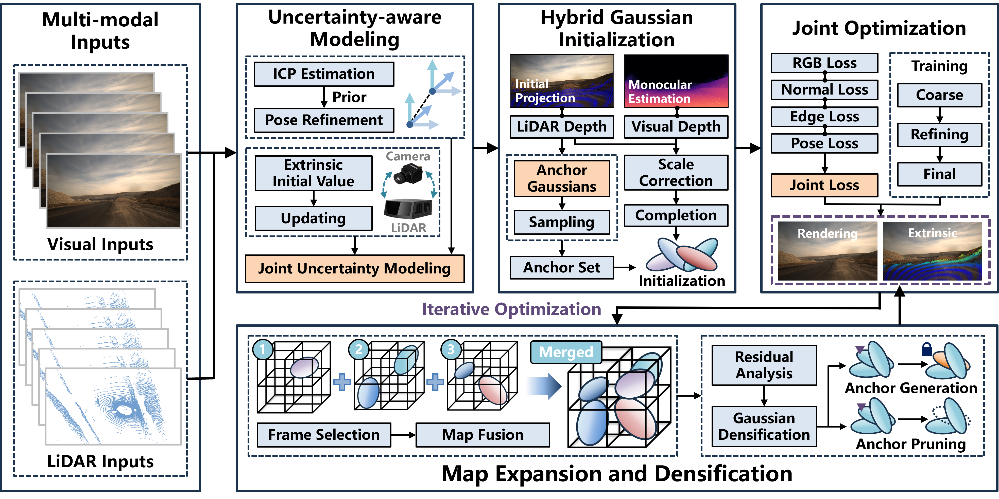

<!-- PROJECT LOGO -->

<p align="center">

  <h1 align="center">ECU-GS: Extrinsic-Calibrated Uncertainty-aware 3D Gaussian Splatting</h1>
  <p align="center">
    COLMAP-free LiDAR-Camera fusion with joint uncertainty modeling, anchor-based scene representation, and iterative Gaussian refinement.
  </p>
  <div align="center"></div>
</p>


## Overview

ECU-GS reconstructs 3D scenes from a sequential RGB video and synchronized LiDAR point clouds **without COLMAP or any pre-computed camera poses**. 

- **Joint uncertainty modeling** of camera poses, LiDAR-Camera extrinsics, and depth, used to weight supervision and guide densification
- **Anchor Gaussian initialization** from LiDAR projection fused with monocular depth completion
- **A three-stage training schedule** (Coarse → Refining → Final) driven by a joint photometric-geometric loss
- **Iterative map optimization** with keyframe selection, map fusion, residual analysis, and uncertainty-aware Gaussian densification

## Code Release Status

This repository currently releases the **framework** of ECU-GS: the progressive COLMAP-free training pipeline, LiDAR-Camera data loading and projection, the renderer, and the evaluation tools. The following core modules are part of our paper's contribution and will be released **after the paper review and our industry partner's internal approval process** — stay tuned:

| Module | File | Status |
|---|---|---|
| Joint uncertainty modeling | `utils/ecugs_uncertainty.py` | 🚧 coming soon |
| Uncertainty-aware & joint losses (Eq. 19/26/27/29) | `trainer/ecugs_losses.py` | 🚧 coming soon |
| Extrinsic calibration, ICP odometry, depth scale matching | `utils/lidar_calibration.py` | 🚧 coming soon |
| Anchor-auxiliary system & hybrid initialization (Eq. 22) | `scene/anchor_auxiliary_gaussians.py` | 🚧 coming soon |
| Geometric constraint losses | `trainer/geometric_constraints.py` | 🚧 coming soon |
| Sky Gaussians | `utils/sky_gaussians.py` | 🚧 coming soon |

The released code runs in base mode out of the box: the corresponding switches are disabled by default in `arguments/__init__.py`, and the training schedule falls back to standard behavior (uniform frame sampling, constant-threshold densification, every frame treated as a keyframe). Enabling the coming-soon flags before the modules are released will raise an explicit `ImportError`.

## Pipeline

<p align="center">
  
</p>

Given an image sequence and the corresponding LiDAR sweeps (left), ECU-GS proceeds as follows:

1. **Joint Uncertainty Modeling.** Camera poses are estimated progressively (ICP estimation from LiDAR + photometric pose refinement), while the LiDAR-Camera extrinsic starts from an initial value and is updated online. Each estimate carries an uncertainty (covariance) that is propagated through the whole pipeline.
2. **Anchor Set Construction.** LiDAR points are projected into the current view (initial projection / LiDAR depth) and fused with monocular depth estimation (visual depth) through scale correction and completion. The fused points initialize *Anchor Gaussians*, which are sampled into the Anchor Set.
3. **Joint Loss & Three-Stage Training.** Rendering is supervised by RGB, normal, edge, and pose losses combined into a joint loss. Training follows a three-stage schedule — Coarse, Refining, and Final — after which the model outputs both the rendered scene and the refined extrinsic calibration.
4. **Iterative Optimization.** New frames are selected by novelty (frame selection) and fused into the global map (map fusion). Residual analysis then spawns new Gaussians where the reconstruction is still poor (Gaussian densification), and the loop repeats.

## Environment

The code has been tested on **Python 3.10, PyTorch 2.1.2, CUDA 11.8** (CUDA >= 11.6 should work). The simplest way to install all dependencies is to use [anaconda](https://www.anaconda.com/) and [pip](https://pypi.org/project/pip/):

```bash
conda create -n ecugs python=3.10
conda activate ecugs
conda install conda-forge::cudatoolkit-dev=11.8.0
conda install pytorch==2.1.2 torchvision==0.16.2 pytorch-cuda=11.8 -c pytorch -c nvidia

git clone https://github.com/YuhanTang-1/ecu_gs.git
cd ecu_gs
pip install -r requirements.txt
```

`pip install -r requirements.txt` compiles the two CUDA submodules (`submodules/diff-gaussian-rasterization` and `submodules/simple-knn`) and installs PyTorch3D and lietorch from source. If compilation fails, check that `CUDA_HOME` is set and `nvcc` is on your `PATH`.

> Note: `environment.yml` is a legacy file for the original 3DGS (Python 3.7 / PyTorch 1.12). Do **not** use it for this codebase.


## Usage

### Data preparation

Place your sequence under `data/<scene>/` with matching RGB and LiDAR filenames:

```
data/your_scene/
├── images/              # 00000.jpg, 00001.jpg, ...
└── lidar/               # 00000.pcd, 00001.pcd, ...
```

### Training (LiDAR-Camera scene)

```bash
python run_ecugs.py \
    -s data/your_scene \
    --mode train \
    --use_lidar \
    --iterations 30000
```

### Evaluation

```bash
# pose estimation
python run_ecugs.py -s data/your_scene --mode eval_pose --model_path ${CKPT_PATH}
# novel view synthesis
python run_ecugs.py -s data/your_scene --mode eval_nvs  --model_path ${CKPT_PATH}
```


## Acknowledgement

We thank our industry partner, China National Heavy Duty Truck Group (Sinotruk), for providing the test scenarios and real-vehicle test data used in this work. Part of the code and the real-vehicle data will be released after the partner's internal approval process is completed, in order to avoid intellectual property issues.

## Citation


```bibtex

```
